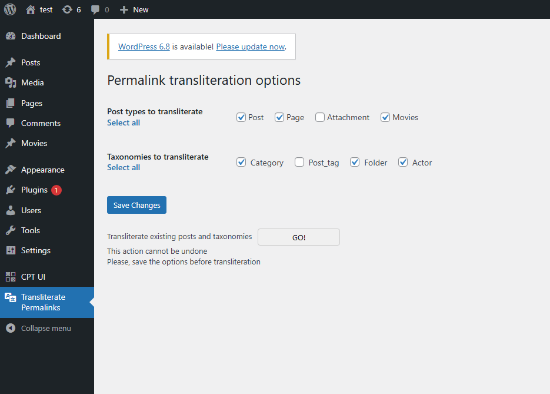

# Transliterate Permalinks

A lightweight WordPress plugin that automatically transliterates non-Latin slugs (permalinks) into Latin characters.  
Perfect for multilingual websites — improves SEO, URL readability, and cross-system compatibility.

---

## 🔧 Features

- Hooks into WordPress `sanitize_title` filter
- Converts Cyrillic, Greek, Armenian, and other non-Latin characters into ASCII
- Optional bulk transliteration for existing posts and taxonomies
- Admin interface with flexible options and a one-click action
- Based on the idea of the Drupal Transliteration module
- No external dependencies

---

## 🚀 Installation

1. Upload the plugin folder to `/wp-content/plugins/`
2. Activate the plugin from the WordPress admin panel
3. That's it — new slugs will be automatically transliterated

---

## ⚙️ Optional Usage

To transliterate existing content (posts, pages, taxonomy terms), you can either:

- Use the **“GO!” button** in the plugin's settings page  
  (found under **Admin dashboard - Transliterate Permalinks**):



- Or call the function manually in your code:

```php
if ( function_exists( 'transliterate_all' ) ) {
    transliterate_all(['post', 'page'], ['category', 'post_tag']);
}
```
- You can customize the post types or taxonomies as needed.

---

## 📁 Folder Structure

transliterate-permalinks/
├── transliterate-permalinks.php       # Main plugin loader
├── class-tp-functions.php             # Transliteration logic
├── class-tp-options.php               # Plugin settings and admin UI
├── data/                              # Transliteration tables
├── assets/                            # Screenshot or additional resources
│   └── tp_script.js
│   └── admin-screenshot.png
├── LICENSE.txt
├── README.md

## 👩 Author
Developed by Lilith Zakharyan
https://github.com/astartha82

## 📄 License
This plugin is open-source and distributed under the terms of the GNU General Public License v2.0.
